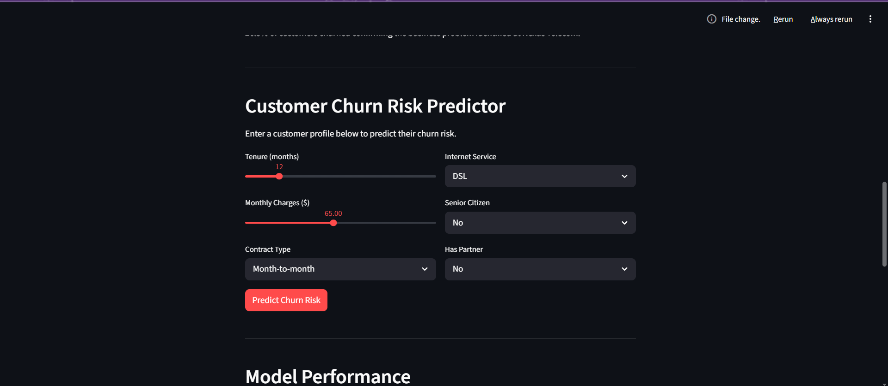

# Customer Churn Prediction - Capstone Project

A machine learning application that predicts customer churn for a telecommunications company using logistic regression and an interactive Streamlit dashboard.

## Live Demo
[Live Dashboard](https://churnproject-pxsbv3q6yny5zt96rdkagm.streamlit.app/)

## Quick Start
To launch the dashboard immediately after cloning and installing dependencies:
python -m streamlit run code/dashboard.py

## Project Overview
This project builds a customer churn prediction model using the IBM Telco Customer Churn dataset. The goal is to identify customers who are at high risk of canceling their service so a retention team can take proactive action before the customer leaves. The application assigns each customer a churn probability score and flags anyone above 60% as high risk with recommended intervention strategies.

## Dashboard Preview

## Features
- Fully functional Streamlit dashboard with interactive visualizations
- Customer churn risk predictor with sliders and dropdowns that generates 
  real time churn probability scores
- Three data visualizations showing overall churn distribution, churn rate 
  by contract type, and monthly charges distribution
- Logistic regression model achieving 82.19% accuracy
- Model performance metrics including accuracy, precision, recall, and 
  confusion matrix displayed directly in the dashboard

## Dataset
IBM Telco Customer Churn dataset from Kaggle
- 7,043 customer records
- 21 features including tenure, monthly charges, and contract type
- Source: https://www.kaggle.com/datasets/blastchar/telco-customer-churn

## Project Structure
churn_project/
├── code/
│   ├── exploration.py        # Data exploration and analysis
│   ├── cleaning.py           # Data cleaning and preparation
│   ├── model.py              # Model training and evaluation
│   ├── visualizations.py     # Chart generation
│   └── dashboard.py          # Streamlit dashboard
├── data/
│   ├── WA_Fn-UseC_-Telco-Customer-Churn.csv    # Raw dataset
│   └── telco_cleaned.csv                         # Cleaned dataset
├── screenshots/              # Project screenshots and charts
├── churn_prediction.ipynb    # Google Colab notebook
└── README.md

## Installation and Setup

Step 1: Clone the repository
git clone https://github.com/BrittanyMcGuire1/churn_project.git

Step 2: Navigate to the project folder
cd churn_project

Step 3: Install required libraries
pip install pandas scikit-learn matplotlib seaborn streamlit

Step 4: Run the data cleaning script first
python code/cleaning.py

Step 5: Launch the dashboard
python -m streamlit run code/dashboard.py

## Model Performance
| Metric | Score | Target |
|--------|-------|--------|
| Accuracy | 82.19% | 75% |
| Precision | 68.71% | 65% |
| Recall | 60.05% | 70% |

## Key Findings
- Month-to-month customers churn at 42.7% vs 2.8% for two year contracts
- Churned customers average $74.44/month vs $61.27 for retained customers
- Average tenure for churned customers is 18 months vs 37.6 months retained
- Contract type is the single strongest predictor of churn

## Technologies Used
- Python 3.11
- Pandas
- Scikit-learn
- Matplotlib
- Seaborn
- Streamlit

## Methodology
This project follows the CRISP-DM methodology across six phases: Business Understanding, Data Understanding, Data Preparation, Modeling, Evaluation, and Deployment.

## Author
Brittany McGuire
WGU Computer Science Capstone